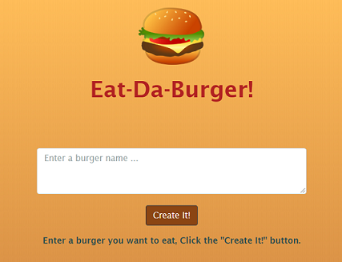
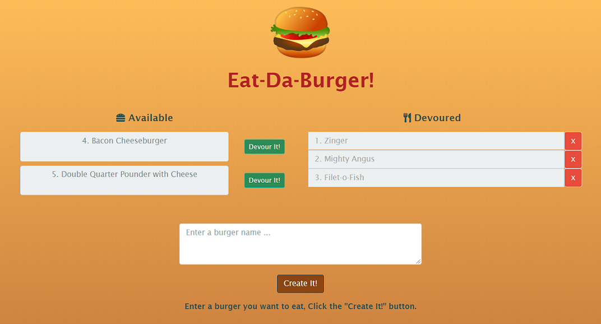
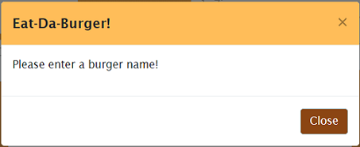
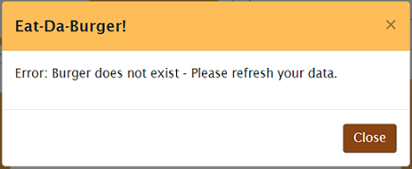
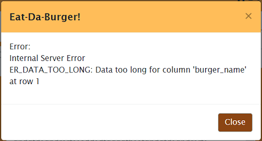
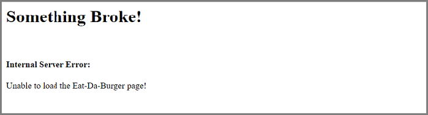

# Eat-Da-Burger

## Description 
<br>

<br><br>

Eat-Da-Burger! is a restaurant app that lets users input names of burgers they'd like to eat. It is powered by Node.js, uses an express backend server and is currently hosted on Heroku. The application also uses a MySQL database to persist data. <br>

Deployed Application: [Eat-Da-Burger](https://gveetil-eat-da-burger.herokuapp.com/)
<br><br>

## Table of Contents 

- [Features](#features)
- [Installation Instructions](#installation-instructions)
- [Usage Guidelines](#usage-guidelines)

<br>

## Features
### Full Stack 
The front end of this application is built using Bootstrap component library along with JQuery and is rendered using the Express Handlebars templating engine. 
The back end of this application uses Node.js with Express as the server and MySQL as the database. This makes it a full stack application having both front and back end components.

### MVC 
This application follows the Model View Controller(MVC) architectural pattern. Using the MVC pattern helps modularize the application by separating the user interface, the business logic, and the data access logic into different components. This in turn increases flexibility, maintainability and scalability of the application.

### Responsive Web Design 
This application is built using Responsive web design principles. Responsive web design provides better accessibility and an optimal viewing experience to the user, by ensuring that web pages render well on different devices and window / screen sizes. To achieve this, I have used the Bootstrap front-end component library to build my pages. 


## Installation Instructions

The application is available on Heroku at: [Eat-Da-Burger](https://gveetil-eat-da-burger.herokuapp.com/)

To install a local instance of the application, follow the steps below:

- #### Node.js  
This application needs Node.js to execute. To install Node.js, run the appropriate installer from https://nodejs.org/en/download/ and follow the prompts to complete the installation. 

- #### Clone this repo
 Clone this repo to your local machine using:
```shell
git clone `https://github.com/Gveetil/Eat-Da-Burger.git`
```

- #### Install packages
You will also need to install the below npm packages to your environment:
 - dotenv
 - express
 - express-handlebars
 - mysql

 Browse to the folder where you cloned the Repo and install the packages:
```shell
$ npm install 
```

- #### MySql database
This application uses a MySql backend database to store data. 
<br>
To create a sample database:<br>

 Browse to the `db` folder inside the folder where you cloned the Repo.<br>
 Start the MySQL command line tool and execute the `schema.sql` and `seeds.sql` files<br><br>

 > 
 > This can be done as below : 
 >
 > ```shell
 > $ mysql -u <user_name> -p  
 >
 > mysql> source schema.sql
 >
 > mysql> source seeds.sql
 > ```

 The database should now be ready for use.

- #### Env settings
 The database connection settings for this application needs to be configured in the .env file. <br><br>
  To configure the database connection in the .env file:
   
   Browse to the folder where you cloned the Repo and create a file named .env
   
   Open this file, add the below keys and save:
```
MYSQL_PORT=3306
MYSQL_HOST=localhost
MYSQL_USER=<your-database-user-name>
MYSQL_PASSWORD=<your-database-password>
MYSQL_DATABASE=employee_db
```

- #### Start the server
To run the server, browse to the local folder where you cloned the Repo and execute 
```shell
$ npm start 
```
The server should now start executing.

- #### Open the Website
Browse to http://localhost:3000 to view the application website.<br><br>

## Usage Guidelines

When the Eat-Da-Burger application is opened, it loads up all the burgers saved in the system and displays the below page:<br><br>

 <br><br>


* To create a new burger - enter the name of the burger and click the 'Create It!' button.
* The burger is then saved and displayed in the list of available burgers.
* If the user selects create and the burger name is not entered, the below validation is displayed:<br><br>
  
 <br><br>

* To eat a burger, click the "Devour It!" button.
* The burger is then updated and moved to the list of devoured burgers.
* To delete a burger from the system, click the red remove button next to it.
* If the burger being deleted or devoured has already been updated by another user, the application displays an appropriate message like:<br><br>
  
 <br><br>

* All internal server errors are notified to the user as below:<br><br>

 <br><br>

* If the application is unable to access the database, or the main application page cannot be loaded up, the user is directed to the below page:<br><br>
  
 <br><br>
